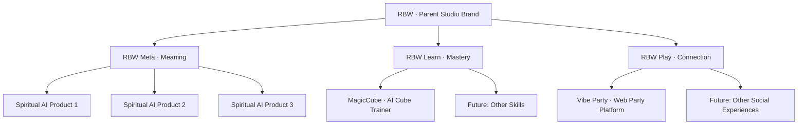

# 03 — Product Portfolio Architecture

> 本文回答：RBW 内部应该如何组织三条产品线？母品牌和子品牌如何关联？每个产品扮演什么角色？

---

## 1. 推荐品牌架构（House of Brands → Branded House 混合模式）

### 推荐方案：**Branded House with Sub-brands（带子品牌的统一母品牌）**

母品牌 **RBW** 永远在前，子品牌作为产品线后缀：

```
                 ┌──────────────────────────┐
                 │          RBW             │
                 │  (Parent / Studio Brand) │
                 └────────────┬─────────────┘
                              │
        ┌─────────────────────┼─────────────────────┐
        │                     │                     │
   ┌────▼─────┐         ┌─────▼──────┐        ┌─────▼─────┐
   │ RBW Meta │         │ RBW Learn  │        │  RBW Play │
   │ (意义)    │        │  (学习)    │        │  (连接)    │
   └────┬─────┘         └──────┬─────┘        └──────┬────┘
        │                      │                     │
  ┌─────┴──────┐          ┌────┴─────┐         ┌─────┴──────┐
  │  3 款玄学   │          │ MagicCube│         │ Vibe Party │
  │  AI 产品   │          │  (首款)   │        │  (首款)    │
  └────────────┘          └──────────┘         └────────────┘
```

### Mermaid 版本（可直接渲染）



### 为什么是 Branded House？

| 选项 | 优点 | 缺点 | 适合 RBW？ |
|---|---|---|---|
| **House of Brands**（每个产品独立品牌，公司隐身，如 P&G） | 单产品聚焦 | 公司无积累、融资难 | ❌ |
| **Branded House**（所有产品都叫 RBW X，如 Google → Google Maps） | 母品牌强、复用度高 | 单产品风险传染 | ⭐⭐⭐⭐ |
| **Hybrid / Endorsed**（产品有独立名字 + "by RBW"背书，如 Beats by Dre） | 兼顾品牌资产与产品独立性 | 沟通复杂度略高 | ⭐⭐⭐⭐⭐ **推荐** |

**最终推荐**：**Hybrid / Endorsed 模式**——
- 产品保留有辨识度的独立名字（**MagicCube**、**Vibe Party**），便于传播；
- 但在所有官方曝光中都带 *"by RBW"* / *"a RBW Studio product"* 背书；
- 母品牌 RBW 作为投资人、媒体、招聘的统一门面。

---

## 2. 三条子品牌线（Product Lines）

### 2.1 RBW Meta — Meaning Line

| 字段 | 内容 |
|---|---|
| **使命** | 让 AI 成为现代人探索意义、情绪、自我的新方式。 |
| **品牌承诺** | "AI for self-discovery, not prediction." |
| **核心用户** | 18–40 岁，60%+ 女性，全球华人 + 英语市场。 |
| **首批产品** | 3 款玄学 AI 产品（具体细节由创始人后续提供）。 |
| **商业模式** | Freemium 订阅 + 付费报告 + AI Companion 增值。 |
| **角色** | **品牌声量 + 高毛利订阅** |
| **当前阶段** | 接近全球发布 |
| **扩展方向** | 冥想 / 睡眠 / 情感陪伴 / 心理日志 |

### 2.2 RBW Learn — Mastery Line

| 字段 | 内容 |
|---|---|
| **使命** | 用 AI 训练系统降低任何一种技能的学习门槛。 |
| **品牌承诺** | "Master anything, with AI by your side." |
| **核心用户** | 6–14 岁儿童及其家长，兼容成人兴趣用户。 |
| **首批产品** | **MagicCube**（AI 智能魔方学习训练系统） |
| **商业模式** | 99 元/年订阅 + 家庭版 + B2B 课后服务包。 |
| **角色** | **现金流验证 + 家长口碑** |
| **当前阶段** | MVP 设计 / 开发期 |
| **扩展方向** | 速算 / 记忆 / 围棋 / 乐器 / 绘画基础 / 编程入门 |

### 2.3 RBW Play — Connection Line

| 字段 | 内容 |
|---|---|
| **使命** | 让现实聚会更快破冰、更有情绪记忆点。 |
| **品牌承诺** | "Open. Play. Remember." |
| **核心用户** | 18–32 岁城市年轻人 + 留学生 + 活动组织者。 |
| **首批产品** | **Vibe Party**（Web-based 派对互动平台） |
| **商业模式** | Freemium + Pro Pass + 主题包 + B2B 活动版。 |
| **角色** | **病毒传播 + 品牌年轻化** |
| **当前阶段** | 待开发 / 设计 |
| **扩展方向** | 旅行同行 App / 团建 SaaS / 节日活动包 |

---

## 3. 每个产品的"角色"（Studio 视角）

借鉴 BCG 矩阵 + 投资组合理论：

| 产品 | 角色定位 | 主要目标 | KPI 重点 |
|---|---|---|---|
| **RBW Meta** | ⭐ Star 候选（高增长 + 高毛利） | 海外用户增长 + 订阅收入 | MAU、付费转化率、ARPU |
| **MagicCube** | 🐄 Cash Cow 候选（现金流稳定） | 中国家长口碑 + 续费 | 付费用户数、续费率、CAC/LTV |
| **Vibe Party** | 🦄 Wild Card（高病毒 + 高品牌价值） | 病毒裂变 + 品牌曝光 | DAU、分享率、邀请系数 K |

> 这种分工本身就是**给投资人讲故事的关键武器**——RBW 不是同时下三个一样的赌注，而是同时验证三种不同的商业引擎。

---

## 4. 产品之间的协同关系（Cross-Product Synergy）

### 4.1 用户层面的导流

```
RBW Meta 用户（情绪 + 自我探索）
        ↓ 推 Vibe Party 主题"暧昧局 / 心动局"
Vibe Party 用户（年轻 + 社交）
        ↓ 推 RBW Meta "聚会后塔罗解读"
MagicCube 家长用户
        ↓ 推 RBW Meta "亲子人格测试"
```

### 4.2 内部能力层面的复用

| 能力模块 | RBW Meta | MagicCube | Vibe Party |
|---|---|---|---|
| Prompt 资产库 | ✅ 核心 | ✅ 教学 prompts | ✅ 主持人 prompts |
| 内容安全护栏 | ✅ 心理边界 | ✅ 儿童内容 | ✅ 派对内容分级 |
| LLM 应用模板 | ✅ Chat / Report | ✅ 教练对话 | ✅ AI 主持人 |
| 数据可视化 | ✅ 性格图谱 | ✅ 训练曲线 | ✅ 派对回顾报告 |
| 用户成长系统 | ✅ 灵性等级 | ✅ 技能等级 | ✅ 派对成就 |
| 视觉设计语言 | ✅ Neon + Cosmic | ✅ Neon + Playful | ✅ Neon + Vibe |

> 同一个**视觉设计语言 (Neon-Vibe Design System)** 让三个产品看起来明显"是一家公司"。
> 同一个**安全/合规模块**避免重复造轮子。
> 同一套**LLM 编排框架**让每个新产品的开发周期从 3 个月压缩到 4–6 周。

### 4.3 数据层面的潜在协同（中长期）

- 同一用户的"意义画像 + 学习画像 + 社交画像" → 未来 RBW 可以做"AI Life Companion"。
- 三种数据让模型对用户的理解远超单一品类竞争对手。
- **隐私 / 同意机制必须前置**（详见 `07_Risk_Compliance.md`）。

---

## 5. URL / Domain 策略建议

| 用途 | 推荐 |
|---|---|
| 公司母站 | **`rbw.co`**（建议尽快注册，作为品牌主域） |
| 临时母站 | `rbwmeta.com` 可继续使用，但长期建议过渡为 `rbw.co` |
| RBW Meta 产品 | `meta.rbw.co` 或独立产品域名 |
| MagicCube | `magiccube.app` / `magiccube.ai` |
| Vibe Party | `vibeparty.app` / `vibe.party` |

> 备选公司域：`rbwstudio.com`、`rbw.ai`、`rbwlab.com`。

---

## 6. 命名建议：Vibe Party 产品的英文 / 中文 / Tagline

### 英文命名候选

1. **Vibe Party**（已有，简单直白）
2. **Tonight** — "for tonight's vibe"
3. **Roomful** — "fill the room with vibes"
4. **HypeRoom**
5. **PartyOS** — 强调 web 平台属性

### 中文命名候选

1. **氛围局**
2. **派对就绪**
3. **今晚有局**
4. **嗨场**
5. **派对开机**

### Tagline 候选

1. **"Open. Play. Remember."**
2. **"Your party. Powered up."**
3. **"打开网页，聚会开机。"**
4. **"派对的开机键。"**
5. **"让每一次聚会都值得发朋友圈。"**

**推荐组合**：英文保留 **Vibe Party**，中文用 **氛围局**，Tagline 用 **"打开网页，聚会开机。"**（中）/ **"Open. Play. Remember."**（英）。

---

## 7. 三个产品的"绝不重叠"原则

为了避免品牌混乱，每个产品都有清晰的"语义占位"：

| 产品 | 语义占位 | 永远不做 |
|---|---|---|
| RBW Meta | "向内的体验" | ❌ 多人互动游戏、❌ 应试学习 |
| RBW Learn | "技能掌握" | ❌ 占卜算命、❌ 派对娱乐 |
| RBW Play | "现场社交" | ❌ 单人冥想、❌ 严肃学习 |

> 这条原则让团队在功能取舍时有明确判断标准，也让用户对每个产品的预期一致。

---

## 8. 多产品组合的资源分配建议

> 详细路线图见 `08_Roadmap_KPI.md`，此处给出原则：

- **80% 资源在 1 个主力产品**，**20% 资源维持另外 2 个产品的"在线状态"**。
- 主力产品按季度轮换：Q1 主力可以是 RBW Meta（出海声量），Q2 主力可以是 MagicCube（现金流），Q3 主力可以是 Vibe Party（病毒）。
- **绝不三个产品同时大版本迭代**。同一周里最多 1 个产品在做大改。
- 跨产品共享底层能力（设计系统、LLM 框架、安全护栏）由创始人 / 1 位核心工程师持续维护。

---

## 9. 投资人 FAQ 速答（产品组合相关）

**Q：为什么要做三个产品？聚焦在一个不是更好？**
A：因为我们正在验证三种不同的商业引擎（订阅 / 现金流 / 病毒）。Vibe coding 让单点尝试成本极低，但学到的市场信号差异极大。这是一个**用低成本买昂贵信息**的策略。

**Q：那你最终会聚焦在哪个？**
A：12 个月内的数据会告诉我们。我们的承诺是：基于 Month-9 的数据，将主力 80% 资源压在一个产品上。

**Q：另外两个怎么办？**
A：要么继续以"维护模式"运营（依然贡献现金流和品牌曝光），要么作为独立 spin-off 寻找合伙人接手，要么 wind down。母品牌 RBW 不受影响。

**Q：三个产品看起来太不一样了。**
A：表面上是。但底层是同一件事——**用 AI 把过去需要专家的体验变成消费产品**。Meta 替代了占卜师，Learn 替代了教练，Play 替代了主持人。我们不是在做不同的事，我们在做同一件事的不同应用。

---

> 下一步阅读：`04_Business_Model.md` — 看看每个产品到底怎么赚钱。
